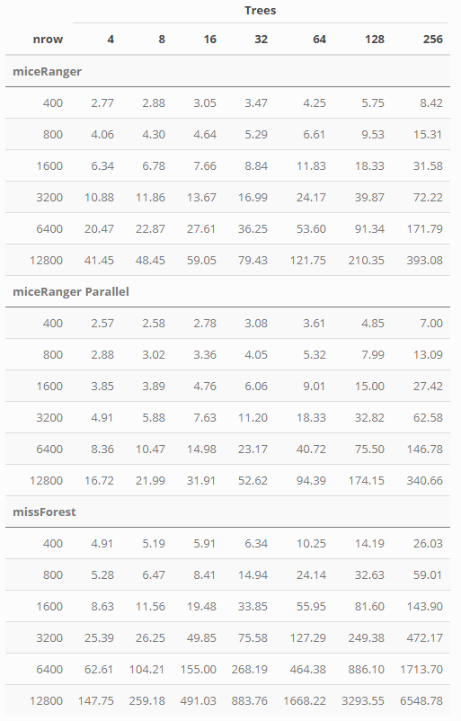

## Benchmarking miceRanger

All scripts to create the following charts can be found in scripts/.

Using artificial data, the time and performance of miceRanger, mice
(`method = "rf"`) and missForest were recorded. parlmice was used to run
`mice` in parallel, and a parallel back end was set up for missForest.
All runs used 5 cores. miceRangerPar refers to miceRanger being run with
`parallel = TRUE`.

### Timing - Small and Medium Data

Scripts used:

  - mediumData.R  
  - smallData.R

### Timing - Rows x Trees

Data used was 10 columns, 7 numeric and 3 factors. Time recorded is in
seconds.  

Script used:

  - rowXtrees.R

### To Do

Imputation accuracy benchmarking with MAR, MCAR, MNAR, skewed,
multimodal data.
